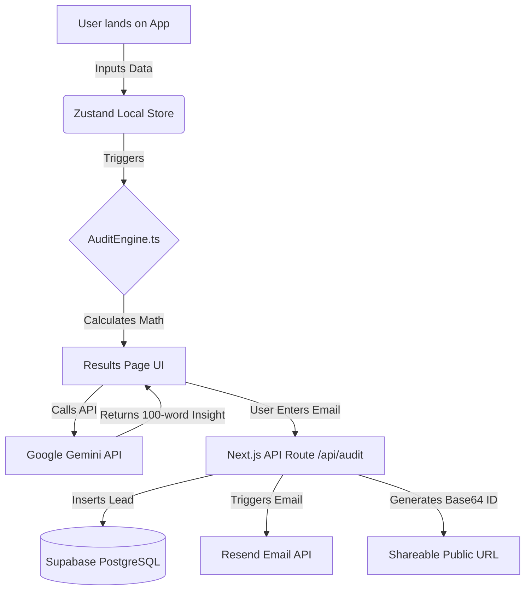

# Architecture

## System Diagram

## Data Flow
1. User enters seats/plan data into the `SpendForm`. Zustand immediately persists this.
2. The `AuditEngine` evaluates the array of tools against hardcoded logic based on `PRICING_DATA.md`.
3. The UI renders the savings. Simultaneously, `components/AISummary` POSTs to `/api/summary` which calls Google Gemini 2.0 Flash for a personalized insight.
4. When the user enters their email, `/api/audit` takes the data, logs it to Supabase (if keys exist), emails the user via Resend, and returns a Base64 encoded payload that acts as the ID for the `app/share/[id]` route.

## Why this stack?
**Next.js (App Router) + TypeScript + Zustand + GSAP**
Next.js provides serverless API routes out-of-the-box, allowing us to call Gemini without exposing keys. Zustand handles the complex multi-step form state infinitely better than React Context. GSAP ensures the interactive feel requested, and TypeScript prevents runtime math errors in the audit engine.

## What I'd change for 10k audits/day
1. **Move Audit Engine to Edge:** Client-side math is fine for an MVP, but at 10k/day, competitors could scrape the logic. I would move `auditEngine.ts` to a Vercel Edge Function.
2. **Redis Rate Limiting:** Introduce Upstash Redis to rate limit the `/api/summary` route to prevent API abuse.
3. **Dedicated DB for Shares:** Replace the Base64 URL hack with actual Postgres row lookups for the share URLs, caching the heavily-accessed shares in Redis.
